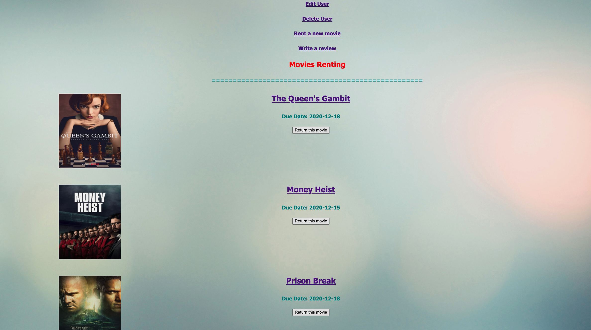
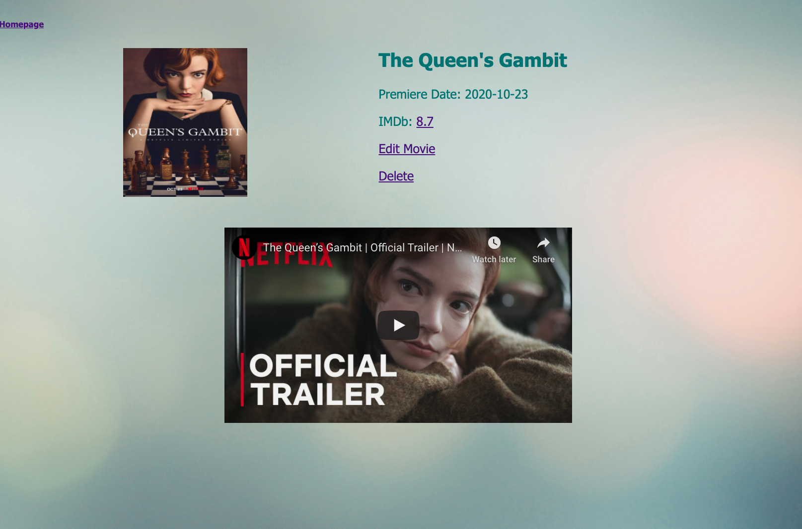

# Movies Renting Rails App

A movies renting application made with Ruby, Rails, Active Record and SQLite.

After 1 week from finishing my first project [movies-renting-CLI](https://github.com/chinguyen21/movies-renting-CLI-app), I was excited to apply the movies renting ideas for this Rails mini project.

## TOOL

1. Ruby
2. Rails
3. Active Record
4. SQLite
  

## INTRUCTIONS

1. Clone this repository
2. Using the terminal navigate to the root directory
3. Run "Bundle Install"
4. Run "rails server"
5. Go to "localhost:3000/users" to check out this project

## FEATURES

* Users can edit their names, emails, addresses and can also delete accounts.
* Users can see all the movies in the application, movies information and movie trailer. Users also can edit movie, delete movie
* Users can rent and return movies.
* Users can keep track their history of renting and those they haven't returned yet.
* Users can post reviews and ratings for movies and it will update the database.

## PREVIEW

